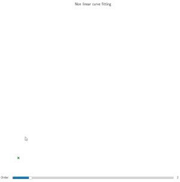
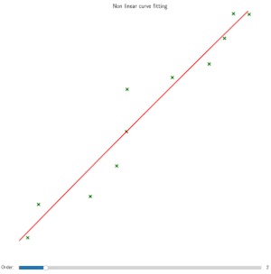

# Non linear regression closed-form

Nonlinear regression using closed form solution is performed through change of basis trick. Non linear functions like polynomials, exponentials or trignometric functions are used as basis functions to create a linear model. The closed-form solution for non linear regression is a mathematical approach that determines the best coefficients of a linear model (constructed using non-linear basis functions) directly. By identifying the values that reduce the sum of squared residuals, it reduces the discrepancy between actual and anticipated values.

 

This code also shows the phenomenon of overfitting and underfitting (2nd figure). Underfitting occurs when a model is too simple to capture underlying patterns, leading to poor performance on both training and test data. Overfitting arises when a model is overly complex, fitting noise in the training data and performing well on training but poorly on test data.


### Usage

run 
```
python3 curve_fitting_closed_form_solution.py
```

This code shows a non-linear model fitting for 1-D input using polynomials as basis functions.
